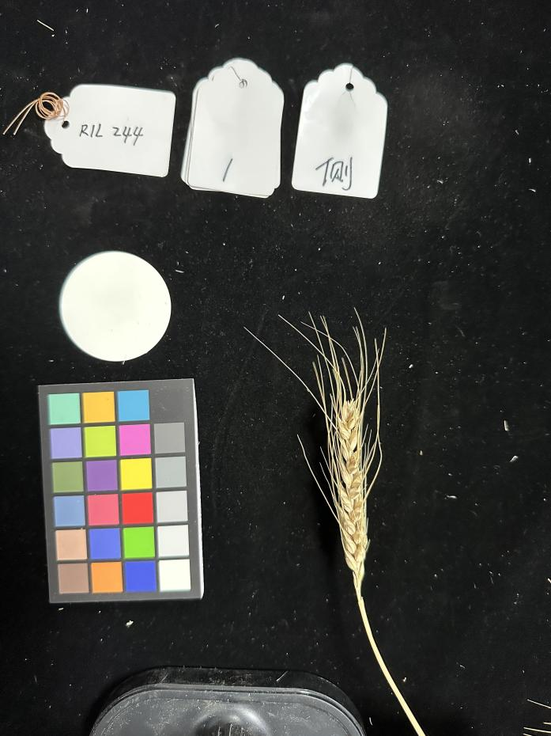
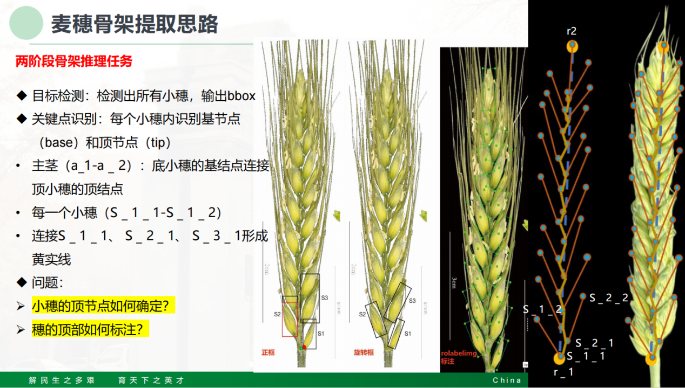
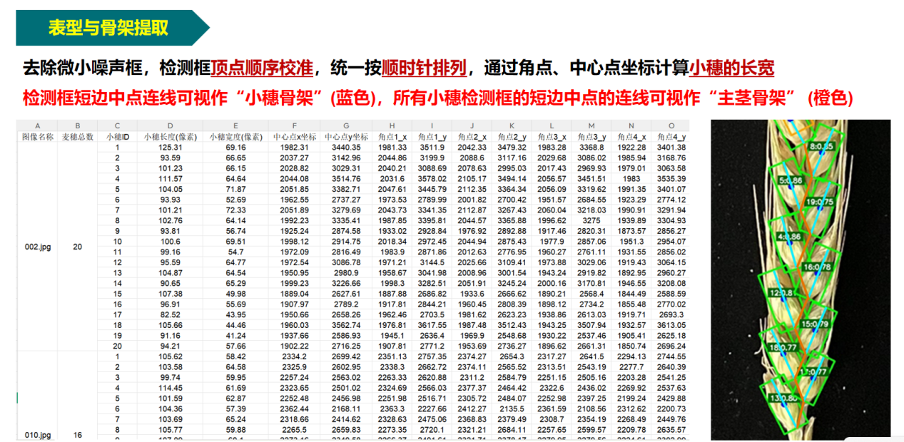

(1) 毕设题目：基于深度学习的小麦麦穗表型分析系统。

(2) 已提供的实验原始材料：87张小麦数据集，数据集样本及其特征如图1所示（本次毕设只需要用到右下方的小麦，其他记号和标定信息暂不涉及）。

图 1

(3) 完成形式：完成小麦麦穗的表型提取算法设计，并完成配套系统开发。

(4) 预期实现的结果：输入图片，检测出所有的小穗，然后提取出全部的表型参数和骨架可视化，把这些功能都集中在一个桌面端/web端系统。

(5) 拟定的技术路线：

1.  数据预处理：

    使用***roLabelimg***标注工具进行旋转矩形框标注。

2.  小穗级目标检测模型构建、训练和优化：

3.  小穗级表型特征提取：提取小穗的长度和宽度等表型（像素尺度即可）

4.  "茎--穗"骨架生成：可见下图说明

    

    

5.  穗型向量\*(创新点尝试):可以通过这个骨架的形状拓扑（或各类表型参数的组合），构建某个特征参数（穗型向量and穗型特征值）用来表示骨架的整体结构，并且这个"穗型向量"不受穗的大小、摆放角度而改变，仅由骨架的形态决定，可以用来唯一表征这个穗，详细可见”D:\Project\PycharmProjects\毕设\创新点尝试.md“

6.  桌面端/web端系统开发：如桌面端使用***PyQt5等***，web端使用其他更适合的框架
