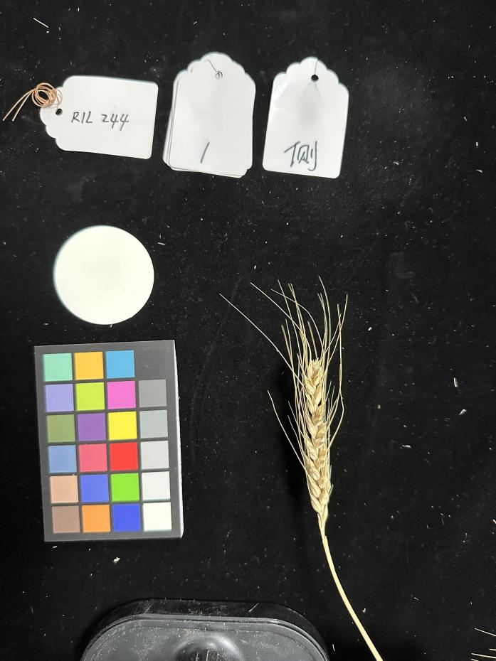
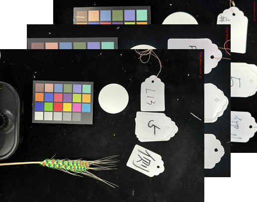
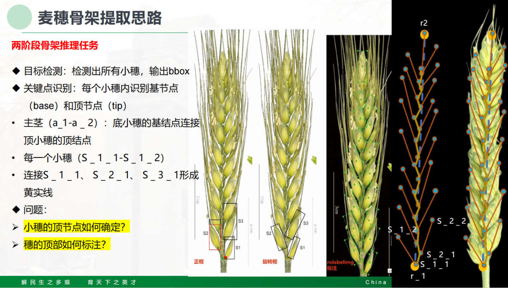
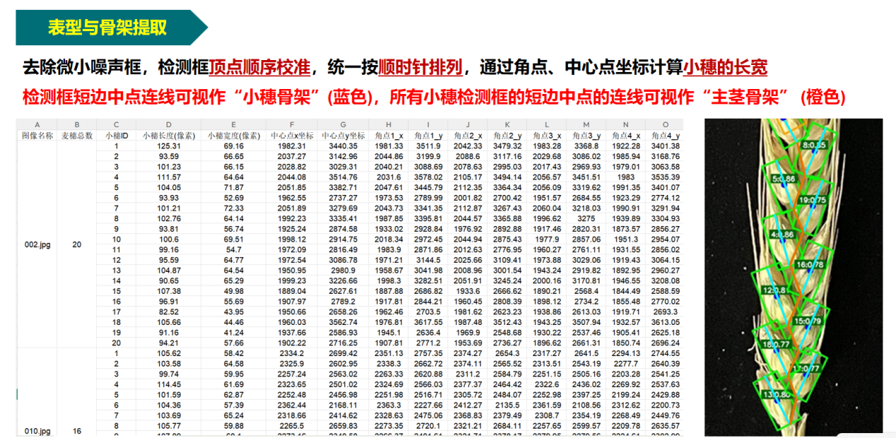
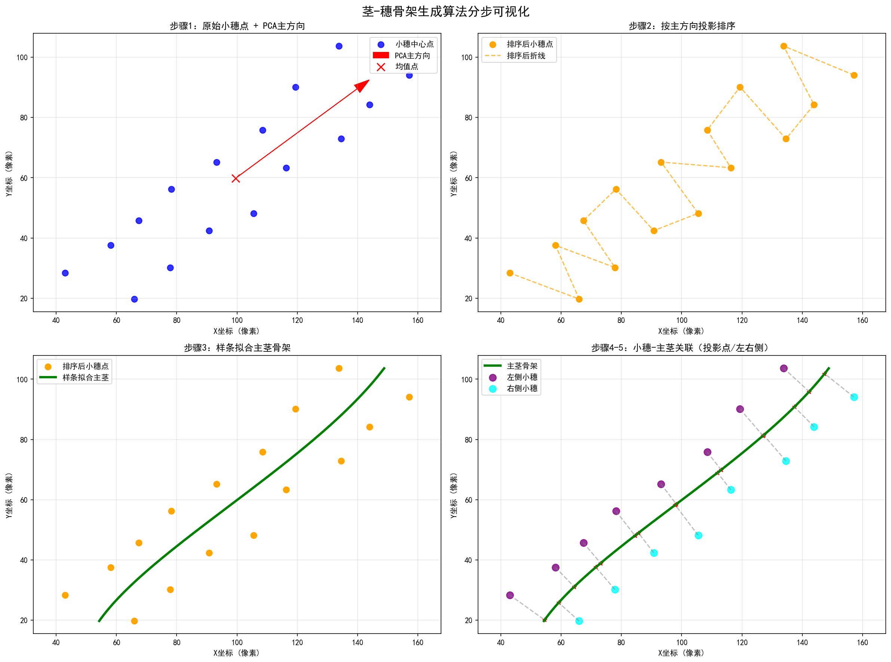

# wheat_analysis 算法模块说明（论文向）

## 1. 模块定位与研究目标

`wheat_analysis` 是本毕设的核心算法层，负责将输入麦穗图像转换为可解释、可聚类、可导出的表型信息。模块实现了从检测、骨架构建、尺度标定、表型提取到聚类分析的完整链路。

核心目标：

- 在复杂背景下稳定获取小穗实例（旋转框 OBB）
- 构建“主茎-小穗”拓扑骨架，提供结构化几何描述
- 提取小穗级、穗级表型特征并形成统一向量
- 支持批量样本聚类与群体差异分析

相关源码：

- [wheat_analysis/detector.py](detector.py)
- [wheat_analysis/calibration.py](calibration.py)
- [wheat_analysis/skeleton.py](skeleton.py)
- [wheat_analysis/phenotype.py](phenotype.py)
- [wheat_analysis/clustering.py](clustering.py)
- [wheat_analysis/visualizer.py](visualizer.py)
- [wheat_analysis/pipeline.py](pipeline.py)

## 2. 总体流程

```mermaid
flowchart TD
    A[输入图像] --> B[YOLO OBB 检测]
    B --> C[白色圆片尺度标定]
    B --> D[小穗长轴端点提取]
    D --> E[PCA 排序 + 样条拟合主茎]
    E --> F[小穗-主茎关联与侧别判定]
    F --> G[小穗级表型计算]
    G --> H[穗级表型聚合]
    H --> I[特征向量构建]
    I --> J[标准化 + PCA]
    J --> K[层次聚类 (Ward)]
    J --> L[t-SNE 可视化嵌入]
    K --> M[簇统计与代表样本]
    L --> N[散点图/树状图/CSV]
```

## 3. 记号定义与坐标约定

| 记号 | 含义 | 维度/单位 |
|---|---|---|
| $N$ | 单图中小穗数量 | 个 |
| $\mathbf{c}_i=(x_i,y_i)$ | 第 $i$ 个小穗中心 | px |
| $\mathbf{p}_{i,k}$ | 第 $i$ 个小穗 OBB 第 $k$ 个角点 | px |
| $\mathbf{t}_i$ | 第 $i$ 个小穗基节点处主茎切线单位向量 | 无量纲 |
| $s_i$ | 第 $i$ 个小穗在主茎上的归一化弧长位置 | $[0,1]$ |
| $\ell_i, w_i$ | 第 $i$ 个小穗长度、宽度 | px 或 mm |
| $\theta_i$ | 第 $i$ 个小穗着生角 | 度 |

图像坐标系遵循 OpenCV 约定：原点在左上角，$x$ 向右，$y$ 向下。

## 4. 子模块算法详解

## 4.1 小穗检测模块（SpikeletDetector）

实现文件：[wheat_analysis/detector.py](detector.py)

### 4.1.1 方法描述

使用 Ultralytics YOLO OBB 模型推理，输出每个小穗的旋转框参数：

$$
(c_x,c_y,w,h,\theta)
$$

并导出四角点：

$$
\{(x_{i1},y_{i1}),\dots,(x_{i4},y_{i4})\}
$$

### 4.1.2 关键后处理

为统一几何语义，代码将短边定义为宽度、长边定义为长度：

$$
w_i=\min(w_i^{raw},h_i^{raw}),\quad \ell_i=\max(w_i^{raw},h_i^{raw})
$$

最终输出结构包含：`xywhr`、`xyxyxyxy`、`centers`、`widths`、`heights`、`angles`、`conf`。

### 4.1.3 参数

| 参数 | 默认值 | 说明 |
|---|---:|---|
| `imgsz` | 1440 | 推理输入尺寸 |
| `conf` | 0.5 | 置信度阈值 |

## 4.2 尺度标定模块（ScaleCalibrator）

实现文件：[wheat_analysis/calibration.py](calibration.py)

### 4.2.1 标定思想

假设拍摄时存在已知直径白色圆片（默认直径 5 cm），通过检测圆片像素直径实现像素-物理尺度换算。

### 4.2.2 检测流程

1. 高斯模糊抑制噪声。  
2. HSV 阈值分割白色区域：$H\in[0,180],S\in[0,70],V\in[150,255]$。  
3. 开闭运算去噪（$5\times 5$ 核）。  
4. 轮廓筛选：面积、圆度、半径。  
5. 以综合评分选取最佳圆片。

圆度定义：

$$
\text{circularity}=\frac{4\pi A}{P^2}
$$

其中 $A$ 为轮廓面积，$P$ 为周长。

评分函数：

$$
\text{score}=\text{circularity}\times\text{fill\_ratio}\times A
$$

### 4.2.3 尺度换算

设检测到圆片像素直径为 $D_{px}$，真实直径为 $D_{cm}$，则：

$$
\text{px\_per\_cm}=\frac{D_{px}}{D_{cm}},\qquad
\text{mm\_per\_px}=\frac{10}{\text{px\_per\_cm}}
$$

### 4.2.4 阈值设置

| 条件 | 阈值 |
|---|---:|
| 轮廓面积 | $A>500$ |
| 圆度 | $\text{circularity}>0.65$ |
| 最小半径 | $r>10$ px |

## 4.3 骨架构建模块（SkeletonBuilder）

实现文件：[wheat_analysis/skeleton.py](skeleton.py)

### 4.3.1 OBB 到主轴端点

对每个小穗 OBB 四边向量：

$$
\mathbf{e}_{i,k}=\mathbf{p}_{i,k+1}-\mathbf{p}_{i,k}
$$

取最长边方向作为长轴方向：

$$
\hat{\mathbf{d}}_i=\frac{\mathbf{e}_{i,k^*}}{\|\mathbf{e}_{i,k^*}\|},\quad
k^*=\arg\max_k\|\mathbf{e}_{i,k}\|
$$

由中心点与长轴方向恢复两端点，按 $y$ 坐标区分“最高点/最低点”。最低点作为小穗基节点。

### 4.3.2 主茎方向估计与排序

设所有基节点为 $\{\mathbf{b}_i\}_{i=1}^{N}$，首先做 PCA：

$$
\Sigma=\frac{1}{N-1}\sum_{i=1}^{N}(\mathbf{b}_i-\bar{\mathbf{b}})(\mathbf{b}_i-\bar{\mathbf{b}})^T
$$

取最大特征值对应特征向量为主方向 $\mathbf{v}$，并统一方向（代码将其约束为“向上”）。

按投影排序：

$$
p_i=(\mathbf{b}_i-\bar{\mathbf{b}})^T\mathbf{v}
$$

### 4.3.3 样条拟合主茎

按排序后的基节点构建弧长参数 $t\in[0,1]$，分别拟合 $x(t),y(t)$ 三次样条（`UnivariateSpline`）。

- 默认平滑项：$s=N\times(\max(L,1)\times0.01)$，其中 $L$ 为折线弧长
- 边界点赋较小权重，减弱端点噪声对整体曲率的影响

主茎弧长由离散采样点累积得到。

### 4.3.4 切线、侧别与顺序

在每个 $t_i$ 处求导得到切线：

$$
\mathbf{t}_i=\frac{(x'(t_i),y'(t_i))}{\|(x'(t_i),y'(t_i))\|}
$$

设基节点为 $\mathbf{b}_i$、中心点为 $\mathbf{c}_i$，定义侧别判定叉积：

$$
z_i=\mathbf{t}_i\times(\mathbf{c}_i-\mathbf{b}_i)
$$

代码中：$z_i\ge0$ 记为右侧（$+1$），$z_i<0$ 记为左侧（$-1$）。

输出关键量：`spikelet_s`（沿茎归一化位置）、`spikelet_side`、`spikelet_order`、`stem_points`、`stem_length`。

## 4.4 表型提取模块（PhenotypeExtractor）

实现文件：[wheat_analysis/phenotype.py](phenotype.py)

### 4.4.1 小穗级特征

1. 长宽比：

$$
\text{AR}_i=\frac{\ell_i}{w_i}
$$

2. 着生角（折叠到 $[0,90^\circ]$）：

设小穗主轴向量为 $\mathbf{a}_i$，主茎切线为 $\mathbf{t}_i$：

$$
\theta_i=\arccos\left(\left|\frac{\mathbf{a}_i\cdot\mathbf{t}_i}{\|\mathbf{a}_i\|\|\mathbf{t}_i\|}\right|\right)\times\frac{180}{\pi}
$$

3. 若标定成功，转换为毫米尺度：

$$
\ell_i^{mm}=\ell_i\cdot\text{mm\_per\_px},\quad
w_i^{mm}=w_i\cdot\text{mm\_per\_px}
$$

### 4.4.2 穗级特征

| 指标 | 代码键名 | 计算方式 |
|---|---|---|
| 小穗数 | `spikelet_count` | $N$ |
| 平均小穗长度 | `mean_spikelet_length` | $\frac{1}{N}\sum_i\ell_i$ |
| 平均小穗宽度 | `mean_spikelet_width` | $\frac{1}{N}\sum_i w_i$ |
| 平均长宽比 | `mean_aspect_ratio` | $\frac{1}{N}\sum_i \text{AR}_i$ |
| 平均着生角 | `mean_attachment_angle` | $\frac{1}{N}\sum_i\theta_i$ |
| 穗长 | `spike_length_px` | 主茎样条弧长 |
| 着生密度 | `spikelet_density_px` | $N/\text{spike\_length\_px}$ |
| 重心偏移度 | `centroid_offset` | $\frac{1}{N}\sum_i s_i$ |

> 注：`centroid_offset` 在当前实现中等于沿茎归一化位置均值（$s_i$ 的均值）。

### 4.4.3 左右不对称指数

以左侧/右侧在 4 个小穗指标上的均值差为基础（长度、宽度、长宽比、着生角），定义：

$$
	ext{SI}=\frac{1}{1+\frac{1}{4}\sum_{m=1}^{4}\frac{|\mu_L^{(m)}-\mu_R^{(m)}|}{\mu_{all}^{(m)}+\varepsilon}}
$$

其中 $\varepsilon$ 用于避免除零。

### 4.4.4 聚类特征向量

`build_feature_vector` 输出 9 维特征，优先使用物理量（mm/cm），否则回退 px：

1. `spikelet_count`  
2. `mean_spikelet_length`  
3. `mean_spikelet_width`  
4. `mean_aspect_ratio`  
5. `mean_attachment_angle`  
6. `spike_length`  
7. `spikelet_density`  
8. `symmetry_index`  
9. `centroid_offset`

## 4.5 聚类分析模块（PhenotypeClusterAnalyzer）

实现文件：[wheat_analysis/clustering.py](clustering.py)

### 4.5.1 预处理与降维

设原始特征矩阵为 $\mathbf{X}\in\mathbb{R}^{N\times d}$。

1. Z-score 标准化：

$$
\mathbf{Z}_{ij}=\frac{\mathbf{X}_{ij}-\mu_j}{\sigma_j}
$$

2. PCA 降维得到 $\mathbf{R}$（维数自适应，最多 10 维且不超过 $N-1$）。

### 4.5.2 聚类与可视化嵌入

- 聚类：在 $\mathbf{R}$ 上做层次聚类（Ward linkage）
- 可视化嵌入：
  - $N<5$：直接取前两维
  - $N\ge5$：t-SNE 到 2D（`perplexity = min(10, N-1)`，下限 2）

Ward 合并代价可写为：

$$
\Delta(A,B)=\frac{|A||B|}{|A|+|B|}\|\bar{\mathbf{r}}_A-\bar{\mathbf{r}}_B\|_2^2
$$

其中 $\bar{\mathbf{r}}_A$ 为簇 $A$ 在降维空间的均值。

### 4.5.3 聚类质量评价

当样本数和簇数满足条件时，计算轮廓系数：

$$
s_i=\frac{b_i-a_i}{\max(a_i,b_i)},\qquad
S=\frac{1}{N}\sum_{i=1}^N s_i
$$

### 4.5.4 簇统计与代表样本

- 簇中心在**原始特征空间**计算均值
- 代表样本定义为到该簇中心欧氏距离最小样本
- 输出每簇均值、取值范围、样本名、代表图等结构化信息

### 4.5.5 产物

- `clustering_results.csv`
- `cluster_centers.csv`
- `cluster_embedding.png`
- `cluster_dendrogram.png`

## 4.6 可视化模块（Visualizer）

实现文件：[wheat_analysis/visualizer.py](visualizer.py)

提供四类可视化输出：

- 检测图（OBB、中心点）
- 骨架图（主茎、小穗长轴、顺序号、左右侧）
- 综合分析图（检测 + 骨架 + 小穗标签 + 穗级摘要）
- 文件落盘保存接口

## 4.7 管线编排模块（pipeline）

实现文件：[wheat_analysis/pipeline.py](pipeline.py)

### 4.7.1 单图管线（SingleImagePipeline）

流程：

1. 读取图像并标定
2. 检测 OBB
3. 骨架构建
4. 小穗级/穗级表型提取
5. 特征向量构建
6. 生成可视化图并输出结构化结果

### 4.7.2 批量管线（BatchImagePipeline）

流程：

1. 遍历图像调用单图管线
2. 汇总 phenotype/features CSV
3. 对有效样本做聚类
4. 输出聚类结构与图形产物

## 5. 默认参数与超参数汇总

| 模块 | 参数 | 默认值 | 作用 |
|---|---|---:|---|
| Detector | `imgsz` | 1440 | 模型输入尺寸 |
| Detector | `conf` | 0.5 | 检测阈值 |
| Calibrator | `disc_diameter_cm` | 5.0 | 圆片真实直径 |
| Skeleton | `spline_smoothing` | `None` | 自动平滑强度 |
| Clustering | `n_clusters` | 3 | 聚类簇数 |
| Clustering | `random_state` | 42 | PCA/t-SNE 随机种子 |

## 6. 复杂度与工程特性

| 阶段 | 主要复杂度（近似） | 说明 |
|---|---|---|
| OBB 检测 | 与模型推理相关 | 通常为端到端耗时主项 |
| 骨架构建 | $O(N\log N)$ | 排序与样条拟合 |
| 表型提取 | $O(N)$ | 向量化统计计算 |
| 层次聚类 | $O(N^2)$ 到 $O(N^3)$ | 与实现和样本规模相关 |

工程特性：

- 算法层完全模块化，可单独替换任意子模块
- 支持像素尺度与物理尺度两套指标
- 输出对前端友好（JSON-safe）与对科研友好（CSV/图像）并存

## 7. 论文可直接引用的图示资源

### 7.1 实验采集与标定示意



### 7.2 数据异常示例（旋转/拼接问题）



### 7.3 骨架提取思路图（方案说明）



### 7.4 表型与骨架抽取展示图



### 7.5 模块内部可视化脚本产图



> 说明：`skeleton_builder_visualization.png` 可通过 [wheat_analysis/skeleton_builder_visualization.py](skeleton_builder_visualization.py) 复现生成。

## 8. 论文写作建议（可直接套用）

建议在论文中按以下结构描述本模块：

1. 方法总览：给出全流程图（检测-骨架-表型-聚类）
2. 几何建模：重点说明 OBB 到主轴端点、PCA 排序、样条骨架
3. 表型定义：列出小穗级与穗级公式（尤其是着生角、对称度）
4. 聚类策略：说明标准化、降维、Ward 层次聚类与轮廓系数
5. 可视化与工程实现：说明如何支持可解释分析和前端交互

## 9. 最小调用示例

```python
from wheat_analysis.pipeline import SingleImagePipeline

pipeline = SingleImagePipeline(
    model_path="runs/obb/yolo11_1440_4/weights/best.pt",
    imgsz=1440,
    conf=0.5,
)

result = pipeline.analyze(
    image_path="data/train/images/001.jpg",
    output_dir="results/demo_single",
)

print(result["ear_pheno"])
print(result["feature_names"])
print(result["feature_vector"])
```

---

如需将本 README 进一步转换为“论文章节体”（例如 3.2 节算法设计、3.3 节特征定义、3.4 节聚类方法），可在此版本基础上直接拆分重排。